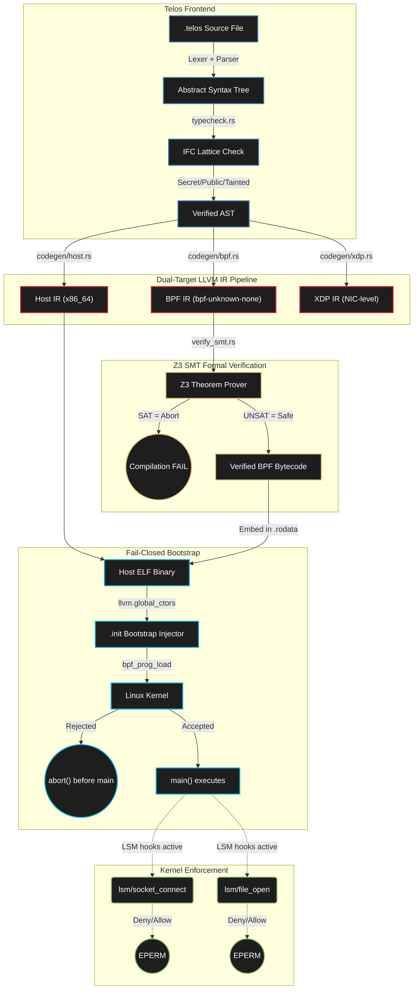

# Telos Lang

### Zero-Trust Policy-as-Code Compiler with Formal Verification

<p align="center">
  
  
  
  
  
</p>

[](https://github.com/nevinshine/telos-lang/actions/workflows/ci.yml)

Telos is a strictly typed, policy-as-code systems language structured for zero-trust Linux environments. It generates formally-verified, fail-closed Linux executables containing embedded eBPF LSM sandboxes directly from your source — unifying application logic with formally-verified Linux kernel security capabilities natively.

---

## What is Telos Lang? (The Simple Version)

Traditional systems languages (C, Rust, Go) separate security from code. You write the application, then bolt on external enforcement layers like AppArmor, SELinux, or Kubernetes policies as an afterthought.

**Telos embeds security directly into the language.** When you write a Telos program, you declare _what the program intends to do_ alongside the logic itself. The compiler then:

1. **Translates** your intent into exact kernel security rules (eBPF-LSM hooks)
2. **Proves** those rules are mathematically safe using the Z3 theorem prover
3. **Embeds** the verified rules directly into the compiled binary
4. **Enforces** a fail-closed bootstrap — if the kernel rejects the security sandbox, the binary self-aborts before `main()` even executes

A Telos binary **mathematically cannot execute its internal logic without its required kernel security matrix.**

> [!IMPORTANT]
> Telos is not a general-purpose language with a massive standard library. It is designed strictly for high-security wedge code — policy-carrying executables that must prove their safety before the first instruction runs.

---

## How It Works (Technical Deep Dive)

Telos is powered by a **Dual-Target LLVM IR Pipeline**, a **static Information Flow Control (IFC) lattice**, and **Microsoft Z3 SMT formal verification**.

### Architecture



### The Dual-Target IR Pipeline

Traditional systems languages compile to a single target. Telos synthesizes **two architectures in one unified pass**:

**1. Host Execution (User-Space LLVM IR)**
- Application logic compiled into x86_64 or AArch64 machine code via the `inkwell` LLVM wrapper
- Standard program flow, variables, functions, I/O

**2. Sandbox Generation (BPF LLVM IR)**
- Capability definitions (`intent` blocks) recursively lowered into `BPF_PROG_TYPE_LSM` eBPF bytecode
- Targets specific Linux Security Module hook points (`socket_connect`, `file_open`, `bprm_check_security`)
- Capabilities automatically mapped into BPF hash maps

### The Fail-Closed Bootstrap Injector

The generated eBPF bytecode array is dynamically linked into the host ELF `.rodata` section. Telos uses `llvm.global_ctors` to synthesize a low-level `.init` preamble that issues raw `bpf(BPF_PROG_LOAD)` syscalls before `main()` execution.

> [!CAUTION]
> If the Linux kernel rejects the internal LSM eBPF sandbox, the binary unconditionally aborts. A Telos binary mathematically cannot execute its internal logic without its required kernel security matrix. The abort manifests as `Illegal instruction (core dumped)` prior to `main()` executing.

---

## Information Flow Control (IFC) Lattice

Telos guarantees non-interference and strictly isolates data trajectories through a transparent, zero-cost security lattice integrated directly into the semantic AST.

### Explicit Data-Flow Control

Variables are annotated using architectural security wrappers: `Secret<T>`, `Tainted<T>`, and `Public<T>`.

```rust
fn core_evaluation() -> Void {
    let critical_token: Secret<String> = "/etc/shadow";
    
    // [TELOS FATAL]: ExplicitLeak("Cannot flow Secret data
    //   into Public sink in assignment 'external_socket'")
    let external_socket: Public<String> = critical_token;
}
```

### Implicit Context Boundaries (Program Dependence Graphs)

Conditional jumps bind their enclosed scope variables. The `typecheck.rs` evaluation model evaluates the structural ceiling via a dynamic Program Counter (PC) stack to prevent indirect leaks:

```rust
fn implicit_leak() -> Void {
    let internal_eval: Secret<I64> = 1;
    let outbound_telemetry: Public<I64> = 0;
    
    // Pushing Secret context onto the local PC evaluation stack
    if internal_eval {
        // [TELOS FATAL]: ImplicitLeak("Cannot flow Secret data
        //   into Public sink in assignment 'outbound_telemetry'")
        outbound_telemetry = 1; 
    }
}
```

### Cryptographic Boundary Casting

`Secret` strings are permanently locked to the execution boundary. They can only be declassified via compiler-whitelisted algorithms:

```rust
fn declassify_example() -> Void {
    let token: Secret<String> = "API_KEY_12345";
    
    // Permitted: SHA-256 is whitelisted for declassification
    let hash: Public<String> = declassify(token, "SHA-256");
    
    // Blocked: raw declassification is never permitted
    let raw: Public<String> = token;  // FATAL
}
```

---

## Z3 SMT Formal Verification

During compilation within `verify_smt.rs`, the generated LLVM Basic Blocks representing the eBPF LSM hooks are statically modeled as Bit-Vector representations. Before the BPF sandbox array is serialized, the Z3 SMT Theorem Prover calculates all operational CFG branching constraints to prove:

| Property | Z3 Constraint | Failure Mode |
|:---------|:-------------|:-------------|
| Division-by-Zero Safety | Denominator != 0 for all division ops | Compilation abort |
| Restricted Shift Ranges | Shift amount < bit-width for all shifts | Compilation abort |
| Pointer Arithmetic Bounds | All GEP offsets within allocation bounds | Compilation abort |
| Valid LSM Return Values | Return is `0` (success) or `-EPERM` (deny) | Compilation abort |

> [!NOTE]
> If the Z3 model evaluates to `SAT` (a violating sequence is computationally possible), compilation aborts. The bytecode is never emitted. Only `UNSAT` (no violation exists) allows the pipeline to proceed.

---

## Features

| Feature | Description |
|:--------|:-----------|
| Dual-Target IR Pipeline | Synthesizes x86_64 host + BPF kernel code in one unified pass |
| Static IFC Lattice | Zero-cost `Secret<T>` / `Public<T>` / `Tainted<T>` with implicit leak detection |
| Z3 SMT Verification | Mathematical proof of memory safety and structural adherence before compilation |
| Fail-Closed Bootstrap | `llvm.global_ctors` injector — binary self-aborts if kernel rejects sandbox |
| Cryptographic Declassification | `Secret` data only exits via SHA-256 or AES-GCM whitelisted algorithms |
| Semantic LSM Intent Extraction | `intent` blocks map directly to BPF hash maps and LSM hooks |
| Pipelock MCP Synchronization | eBPF ringbuffer streaming to JSON-RPC consumer for MCP telemetry |
| AARM Forensic Receipts | SipHash-2-4 IR generation for tamper-evident Autonomous Action compliance |
| Hyperion XDP Bridge | `BPF_PROG_TYPE_XDP` code generation for hardware-level NIC drops |

---

## Getting Started

### Prerequisites

- Rust Toolchain (stable)
- LLVM 15+ (for `inkwell` LLVM wrapper)
- Z3 SMT Solver (via system package manager)
- Linux Kernel >= 5.15 (eBPF LSM support required)
- `sudo` / `CAP_BPF` for loading eBPF programs

### 5-Minute Quickstart

```bash
# 1. Clone the repository
git clone https://github.com/nevinshine/telos-lang.git
cd telos-lang/telosc

# 2. Build the compiler pipeline
cargo build

# 3. Compile & Run the demonstration sandbox (root required for BPF)
sudo cargo run tests/hello_world.telos
```

> [!WARNING]
> `sudo` is required to attach the compiled eBPF LSM sandboxes to the kernel. If `CAP_BPF` is missing, the binary executes a strict fail-closed trap and aborts instantly.

### CLI Commands

```bash
telosc new <name>       # Create a new Telos project
telosc check <file>     # Parse and type-check without compilation
telosc verify <file>    # Run Z3 formal verification only
telosc build <file>     # Full compilation pipeline
```

---

## Demonstrations

### Demo 1: Information Flow Control

```bash
./demo_1_ifc.sh
```
Demonstrates the IFC lattice catching both explicit and implicit data leaks at compile time.

### Demo 2: Z3 Formal Verification

```bash
./demo_2_z3.sh
```
Shows the Z3 SMT solver proving memory safety constraints on the generated eBPF basic blocks.

### Demo 3: BPF Sandbox Loading

```bash
./demo_3_bpf.sh
```
Full end-to-end: compile, verify, emit eBPF, load sandbox, execute with kernel enforcement.

---

## Project Structure

```
telos-lang/
├── telosc/                        # Rust compiler crate
│   ├── src/
│   │   ├── main.rs                # CLI entry point (new/check/verify/build)
│   │   ├── parser.rs              # Telos lexer and recursive descent parser
│   │   ├── typecheck.rs           # IFC lattice enforcement and type checking
│   │   ├── codegen/
│   │   │   ├── mod.rs             # Codegen orchestrator
│   │   │   ├── host.rs            # x86_64 host LLVM IR generation
│   │   │   ├── bpf.rs             # BPF LLVM IR generation (LSM hooks)
│   │   │   ├── xdp.rs             # XDP LLVM IR generation (NIC drops)
│   │   │   ├── bootstrap.rs       # Fail-closed .init preamble synthesis
│   │   │   ├── verify_smt.rs      # Z3 SMT formal verification engine
│   │   │   ├── pipelock.rs        # MCP ringbuffer synchronization
│   │   │   └── aarm_crypto.rs     # SipHash-2-4 forensic receipt generation
│   │   └── heki/                  # Heki hypervisor integration module
│   ├── tests/
│   │   ├── hello_world.telos      # Showcase demonstration policy
│   │   ├── e2e_policy.telos       # End-to-end intent + IFC + enforcement
│   │   ├── ifc_fail.telos         # Explicit leak rejection test
│   │   ├── ifc_implicit.telos     # Implicit leak (PDG) rejection test
│   │   ├── declassify_pass.telos  # Whitelisted declassification test
│   │   ├── declassify_fail.telos  # Blocked declassification test
│   │   ├── loops_pass.telos       # Bounded loop verification
│   │   ├── loops_fail.telos       # Unbounded loop rejection
│   │   ├── intent_syntax.telos    # Intent block parsing test
│   │   ├── pipelock_sync.telos    # MCP ringbuffer test
│   │   └── cli_test.rs            # CLI integration tests
│   └── Cargo.toml
├── demo_1_ifc.sh                  # IFC demonstration script
├── demo_2_z3.sh                   # Z3 verification demonstration
├── demo_3_bpf.sh                  # Full BPF sandbox demonstration
├── THREAT_MODEL.md                # Formal security guarantees and limitations
├── RELEASE_NOTES.md               # v0.1.0-rc1 release notes
└── README.md
```

---

## Engineering Phases

<details>
<summary><b>Phase 1-3: Foundation</b> — Parser, IFC, and Host Codegen</summary>

- Recursive descent parser for `.telos` files
- IFC lattice with `Secret<T>`, `Public<T>`, `Tainted<T>` wrappers
- Explicit and implicit leak detection via Program Dependence Graphs
- Host-side x86_64 LLVM IR generation via `inkwell`

</details>

<details>
<summary><b>Phase 4-5: Kernel Sandbox</b> — BPF Codegen and Bootstrap</summary>

- `BPF_PROG_TYPE_LSM` code generation targeting `socket_connect` and `file_open` hooks
- Capability-to-map extraction for eBPF hash map population
- Fail-closed `.init` bootstrap via `llvm.global_ctors`
- `bpf(BPF_PROG_LOAD)` syscall synthesis in the ELF preamble

</details>

<details>
<summary><b>Phase 6: Z3 Formal Verification</b></summary>

- Bit-Vector modeling of all eBPF basic blocks
- Division-by-zero, shift range, pointer bounds, and LSM return value constraints
- SAT = abort, UNSAT = safe compilation path

</details>

<details>
<summary><b>Phase 7: Cryptographic Declassification</b></summary>

- Compiler-whitelisted algorithms for `Secret` boundary crossing
- SHA-256 and AES-GCM declassification support
- All other boundary crossings are compile-time fatal errors

</details>

<details>
<summary><b>Phase 8: AARM Forensic Receipts</b></summary>

- Native SipHash-2-4 IR generation within the eBPF context
- Tamper-evident forensic receipts for Autonomous Action Runtime Management compliance

</details>

<details>
<summary><b>Phase 9: Hyperion XDP Bridge</b></summary>

- `BPF_PROG_TYPE_XDP` code generation for hardware-level NIC drops
- Intercepts and drops unauthorized packets at the NIC driver level
- Bypasses the kernel networking stack entirely for extreme performance

</details>

---

## Threat Model

**What Telos v0.1 Guarantees:**
- Complete Information Flow Control — `Secret` data cannot leak to `Public` sinks
- Formal Memory Safety via Z3 — no undefined pointer offsets, bounded shift ranges
- Fail-Closed Synchronization — binary self-aborts if kernel rejects the sandbox

**What Telos v0.1 Does Not Protect Against:**
- Host-side denial of service / memory exhaustion (host code runs under standard Linux limits)
- Declassification exploitability (compiler trusts intentional `declassify` calls)
- Hardware / micro-architectural side channels (Spectre variants are out of scope)

See [THREAT_MODEL.md](THREAT_MODEL.md) for the full formal specification.

---

## Architecture and Interoperability Matrix

| Execution Layer | Sentinel Component | Primary Technology & Enforcement | Strategic Objective |
|:------|:------|:------|:------|
| Ring -1 (Hypervisor) | `sentinel-vmi` | AMD-V / NPT Guard / ARMv8 EL2 | Out-of-band Hypervisor Introspection, memory monitoring |
| **Ring 0 (Compile)** | **`telos-lang`** | Rust / LLVM / Z3 SMT | Intent-to-eBPF compiler with formal verification |
| Ring 0 (Runtime) | `telos-runtime` | eBPF-LSM | Intent correlation, Information Flow Control (IFC), and Taint Tracking |
| Ring 0 (Runtime) | Sentinel RT | Seccomp / eBPF / io_uring | Host Intrusion Detection System (HIDS), Citadel recursive tracking |
| Wire / Physical NIC | `hyperion-xdp` | XDP / eBPF | Wire-speed network drop and proxy enforcement |

---

## Development

```bash
cd telosc

cargo check             # Type-check without building
cargo build             # Build the compiler
cargo test              # Run all tests (IFC, loops, declassify, CLI)
cargo test -- --nocapture  # Tests with stdout visible
sudo cargo run tests/hello_world.telos  # Full end-to-end demo
```

---

## License

MIT License — see [LICENSE](LICENSE).

---

<p align="center">
  <b>Telos Lang</b> — <em>Because intent should be the perimeter.</em>
</p>
